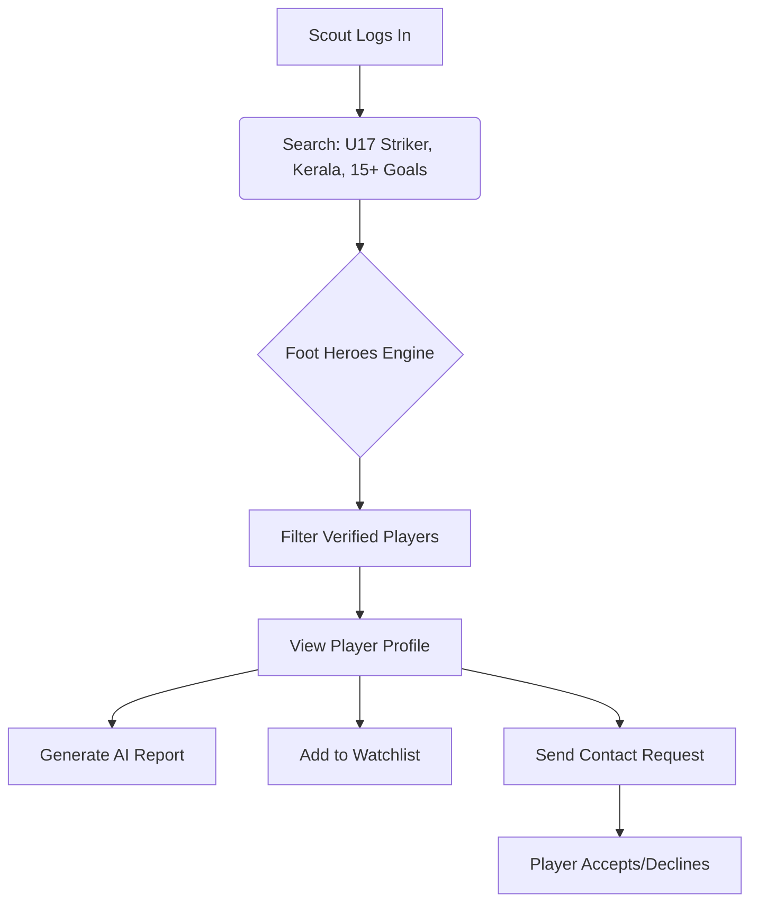
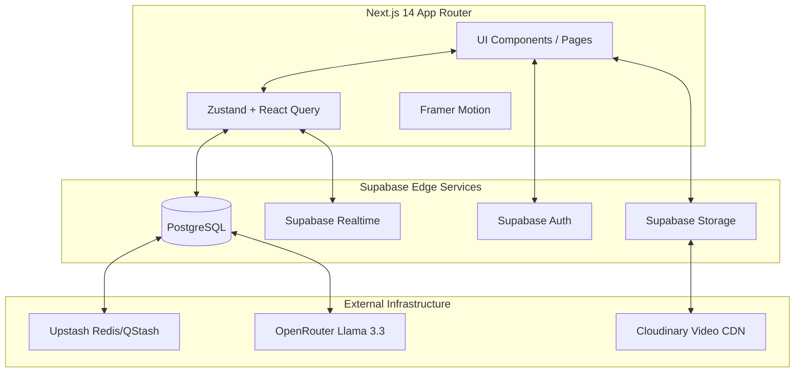
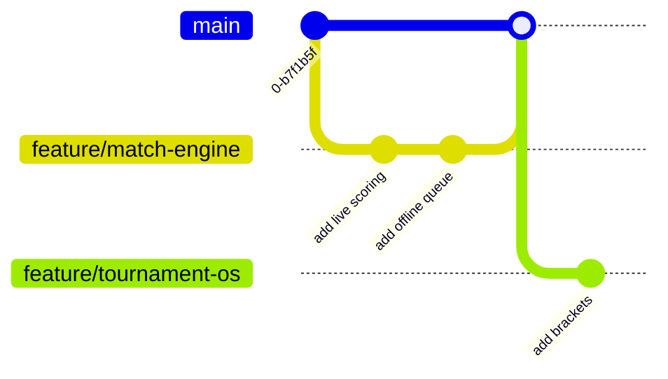

<div align="center">

  

  <br/>

  [](#)
  [](#)
  [](#)
  [](#)
  [](#)

  **India's Football Data Infrastructure & Scouting Network**

  <br/>

  <nav>
    <a href="#-exterior--project-overview">🏢 Exterior</a> •
    <a href="#-reception--about-the-project">🚪 Reception</a> •
    <a href="#-vision-floor">👔 Vision</a> •
    <a href="#-product-floor">📦 Product</a> •
    <a href="#️-engineering-floor">⚙️ Engineering</a> •
    <a href="#-intelligence-lab">🤖 Intelligence</a> •
    <a href="#️-infrastructure-floor">☁️ Infrastructure</a> •
    <a href="#-security-center">🔒 Security</a> •
    <a href="#-operations-room">📊 Operations</a> •
    <a href="#-research--innovation-lab">🧪 Research</a> •
    <a href="#-command-center">🎯 Command</a> •
    <a href="#-archive">📚 Archive</a>
  </nav>

</div>

<br/>

---

### 🏢 Exterior — Project Overview

> *"The scoring screen is 5% of the product. The remaining 95% is the football graph. Every goal scored. Every card. Every tournament won. Permanently. Verifiably. Searchable."*

| Attribute | Details |
| :--- | :--- |
| **Project Name** | Foot Heroes |
| **Version** | 1.0.0 (Pre-Release) |
| **Status** | Active Development |
| **Type** | Web Application / SaaS Platform |
| **URL** | [footheroes.in](https://footheroes.in) |
| **Primary Language** | TypeScript |
| **License** | Proprietary |
| **Author** | Prithish Misra / FootHeroes Team |

<br/>

---

### 🚪 Reception — About the Project

Foot Heroes is India's football data infrastructure—the permanent digital identity layer for every grassroots football player in the country. It combines the data-depth of Transfermarkt, the grassroots reach of CricHeroes, and the professional networking of LinkedIn.

#### Target Audience & Use Cases
| User Type | Core Use Case |
| :--- | :--- |
| **Player** | Maintain a verified, permanent digital identity, track career stats, and get scouted. |
| **Scout / Coach** | Discover verified talent nationally using advanced search filters and AI reports. |
| **Tournament Organizer** | Automate fixtures, brackets, registrations, and live scoring. |
| **Team Manager** | Manage squad rosters, team history, and track aggregate player performances. |

#### The Core Problem
```diff
- ❌ BEFORE:
- Disconnected tournaments. WhatsApp groups for transfers.
- Lost statistics. No verified career records.
- Scouts physically traveling blindly to find talent.

+ ✅ AFTER:
+ A permanent, searchable, verifiable football graph.
+ "U17 striker, Uttar Pradesh, 20+ goals this season"
+ Returns verified profiles with full career records instantly.
```

<br/>

---

### 👔 Vision Floor

> *"Not a tournament management app. Not a score tracker. India's football data infrastructure."*

| Design Principle | Application |
| :--- | :--- |
| **Permanent Identity** | Players own their profiles forever. Stats accumulate across all teams and tournaments. |
| **Data Transparency** | Every stat is backed by a verified match event. "No mock data anywhere." |
| **Premium Aesthetic** | "FIFA meets Transfermarkt meets ESPN FC." Dark, energetic, sports broadcast feel. |
| **Mobile-First UX** | Live scoring works flawlessly on a scorer's phone at a rural ground. |

<br/>

---

### 📦 Product Floor

#### Core Feature Set
| Feature | Status | Description |
| :--- | :--- | :--- |
| **Player Identity** | 🟢 Active | Verified career stats, match history, and achievements. |
| **Match Engine** | 🟢 Active | Real-time event logging (Goals, Cards, Subs) tailored for poor networks. |
| **Tournament OS** | 🟡 Building | Automated fixtures, standings, registrations, and group brackets. |
| **Discovery Engine** | 🟡 Building | Advanced scout search by position, age, state, and form. |
| **AI Reports** | ⚪ Planned | Auto-generated scouting reports and match summaries. |

#### User Flow: The Scout Journey


<br/>

---

### ⚙️ Engineering Floor

#### System Architecture


#### Technology Stack
| Layer | Technology | Purpose |
| :--- | :--- | :--- |
| **Frontend** | Next.js 14 (App Router), React | Core application framework. |
| **Styling** | Tailwind CSS, Framer Motion | Design tokens, animations, responsive layouts. |
| **State** | Zustand, React Query | Client state and server data caching. |
| **Database** | PostgreSQL (Supabase) | Relational data, RLS, and vector embeddings (`pgvector`). |
| **Realtime** | Supabase Realtime | Live match score broadcasting without refresh. |
| **Queue/Cache**| Upstash Redis & QStash | Rate limiting, async jobs, notifications. |

#### Key Engineering Decisions
- **Offline-First Scoring:** Match events queue via `IndexedDB` and sync automatically when network restores, ensuring scorers never lose data at remote grounds.
- **Row Level Security (RLS):** Private player data (phone numbers, private scouting notes) is strictly protected at the database level.
- **Serverless Edge:** API routes optimized for fast execution, crucial for the 200ms real-time scoring feel.

<br/>

---

### 🤖 Intelligence Lab

| Model / Tech | Function | Description |
| :--- | :--- | :--- |
| **Llama 3.3 70B** | Content Generation | Auto-generates post-match reports and scouting evaluations. |
| **OpenAI Embeddings**| Semantic Search | Powers advanced player discovery using vector similarity (`pgvector`). |
| **FFmpeg** | Video Processing | Automated highlight clip generation from raw uploaded match footage. |

**Inference Workflow:**
1. Match completes ➡️ 2. Stats aggregated ➡️ 3. QStash queue triggers Edge Function ➡️ 4. LLM analyzes player stats ➡️ 5. Scouting report saved to DB.

<br/>

---

### ☁️ Infrastructure Floor

```text
+-----------------------+      +-----------------------+
|      Vercel Edge      |      |   Supabase Platform   |
| (Frontend & API)      | ---> | (Auth, DB, Realtime)  |
+-----------------------+      +-----------+-----------+
            ^                              |
            |                              v
+-----------------------+      +-----------------------+
|  Upstash (Redis/Q)    |      |  Cloudinary (Media)   |
+-----------------------+      +-----------------------+
```

#### Environment Variables
| Variable | Description |
| :--- | :--- |
| `NEXT_PUBLIC_SUPABASE_URL` | Supabase project URL |
| `NEXT_PUBLIC_SUPABASE_ANON_KEY` | Public anonymous key for client |
| `SUPABASE_SERVICE_ROLE_KEY` | Admin key for backend tasks |
| `UPSTASH_REDIS_REST_URL` | Redis instance URL |
| `OPENROUTER_API_KEY` | Key for LLM inferences |

<br/>

---

### 🔒 Security Center

| Component | Status | Description |
| :--- | :--- | :--- |
| **Row Level Security** | ✅ Active | Enforced on all tables (e.g., Players edit own profiles, Scouts see private data). |
| **Input Validation** | ✅ Active | Zod schemas on all API routes. No raw SQL. |
| **Rate Limiting** | ✅ Active | Upstash Redis limits high-frequency endpoints (e.g., 30 match events/min). |
| **File Uploads** | ⚠️ Pending | Needs strict MIME type validation and size limits (max 200MB video). |

<br/>

---

### 📊 Operations Room

#### Development Workflow


#### Quality Checklist
- [ ] Strict TypeScript (`noImplicitAny`).
- [ ] Mobile-first responsiveness (tested at 375px).
- [ ] Accessible color contrasts (especially the dark theme).
- [ ] Real-time latency < 200ms on live events.

<br/>

---

### 🧪 Research & Innovation Lab

| Priority | Enhancement | Effort | Description |
| :---: | :--- | :--- | :--- |
| 🔴 High | **Automated Highlights** | Large | Upload full match, extract goals using timestamp tags. |
| 🟡 Med | **Venue Booking** | Medium | Direct turf booking via the venue database. |
| 🟢 Low | **FUT-style Cards** | Small | Downloadable graphic cards for players to share on Instagram. |

<br/>

---

### 🎯 Command Center

| Milestone | Status | Details |
| :--- | :---: | :--- |
| **Phase 1: Player Identity** | ✅ | Core schema, profiles, UI design system. |
| **Phase 2: Match Engine** | ⬜ | Realtime live scoring, offline support. |
| **Phase 3: Tournament OS** | ⬜ | Registration flows, automated brackets. |
| **Phase 4: Discovery Portal**| ⬜ | Scout dashboards, AI search integration. |

**Known Limitations:**
- Initial release will rely on manual data entry for historical stats.
- Video highlight processing is restricted by free-tier API limits.

<br/>

---

### 📚 Archive

- **Design System Elements:** `Background: #0A1628`, `Primary: #22C55E`, `Font: Bebas Neue / Inter`.
- **Glossary:**
  - *Football Graph*: The interconnected data of players, teams, matches, and venues.
  - *RLS*: Row Level Security in PostgreSQL.
- **Support:** Contact the development team for database migrations or architecture changes.

<br/>

---

<div align="center">
  <p><i>"Stop Playing in the Shadows. Your goals deserve a record."</i></p>
  <br/>
  
  <a href="https://github.com/prithishmisra23">
    
  </a>
</div>

---

### Android App

The repo now includes a native Android shell in [android](D:\FootHeroes\android) powered by Capacitor.

#### What was added

- Android project scaffold under `android/`
- Capacitor config in [capacitor.config.ts](D:\FootHeroes\capacitor.config.ts)
- Package scripts for Android sync/open/run in [package.json](D:\FootHeroes\package.json)
- Native back navigation support in [MainActivity.java](D:\FootHeroes\android\app\src\main\java\com\footheroes\app\MainActivity.java)

#### First-app workflow

1. Set `CAPACITOR_ANDROID_APP_URL` to your hosted Foot Heroes web app URL.
2. Run `npm run android:sync`
3. Run `npm run android:open`
4. Build/sign the APK or AAB from Android Studio

If `CAPACITOR_ANDROID_APP_URL` is not set yet, the Android app falls back to the placeholder web bundle in [out/index.html](D:\FootHeroes\out\index.html).
